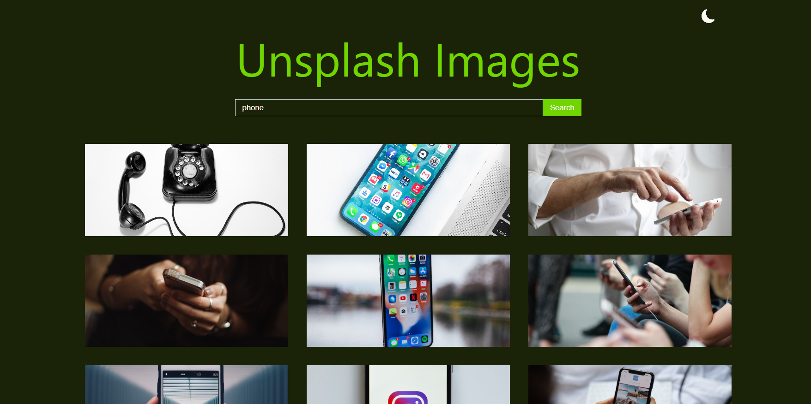
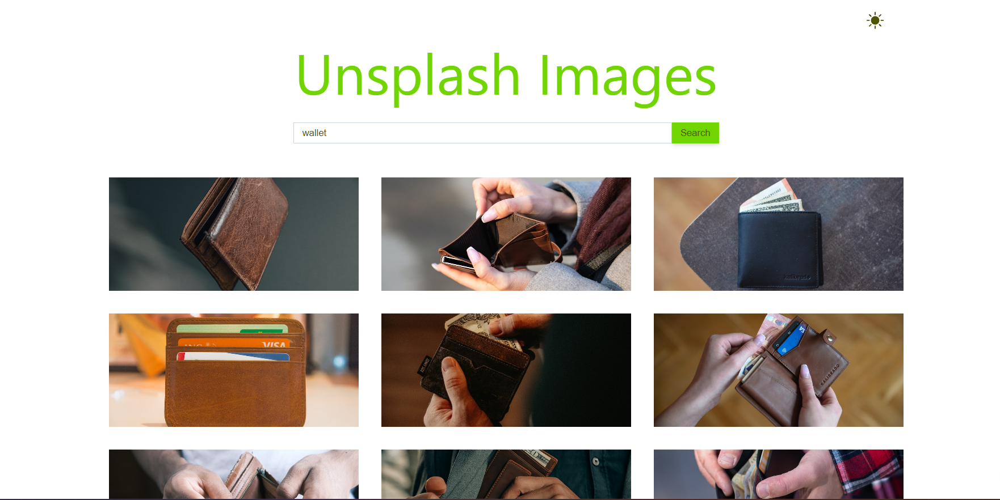
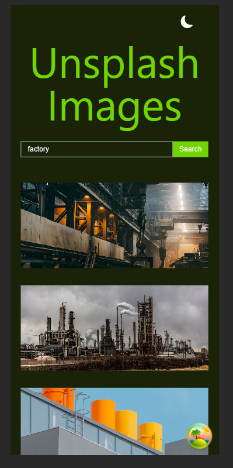
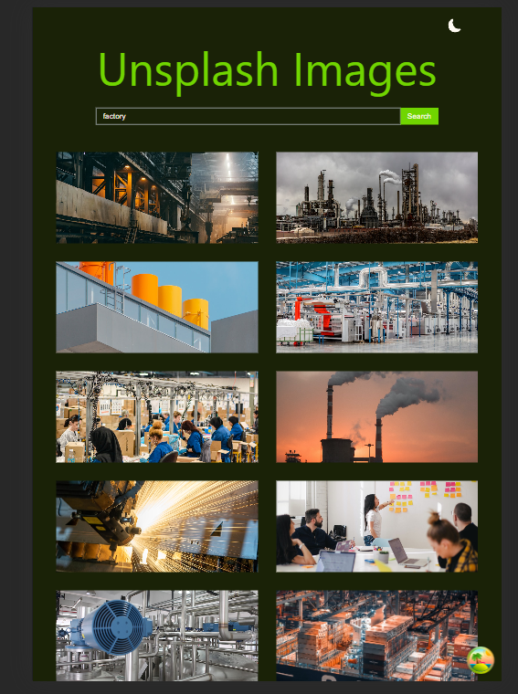

# image-search

Image search application from unsplash api with react query

## Installation

To run this project locally, you'll need to have `Node.js` and `npm` installed. Then follow these steps:

1. Install dependencies:
    ```bash
   npm install
    ```
2. Start the development server:
    ```bash
   npm run dev
    ```

**Dark mode**



**Light mode**



**Phone**



**Tablet**



